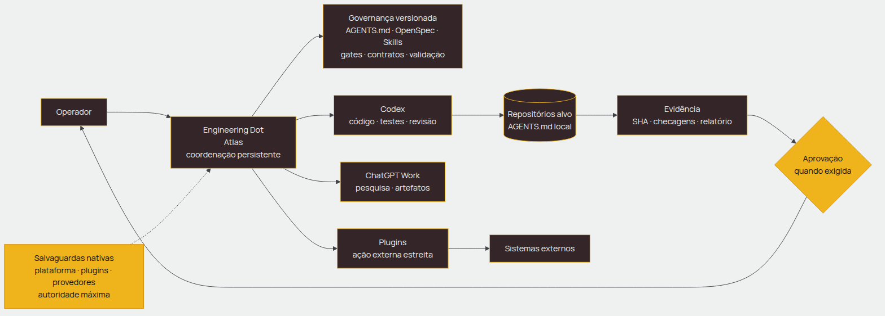
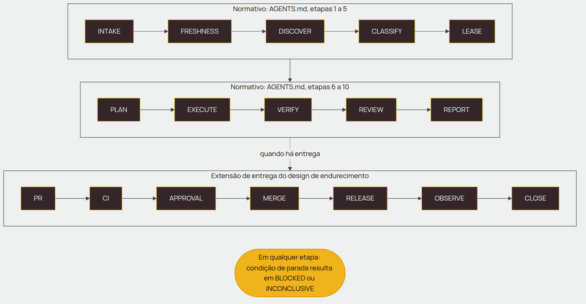
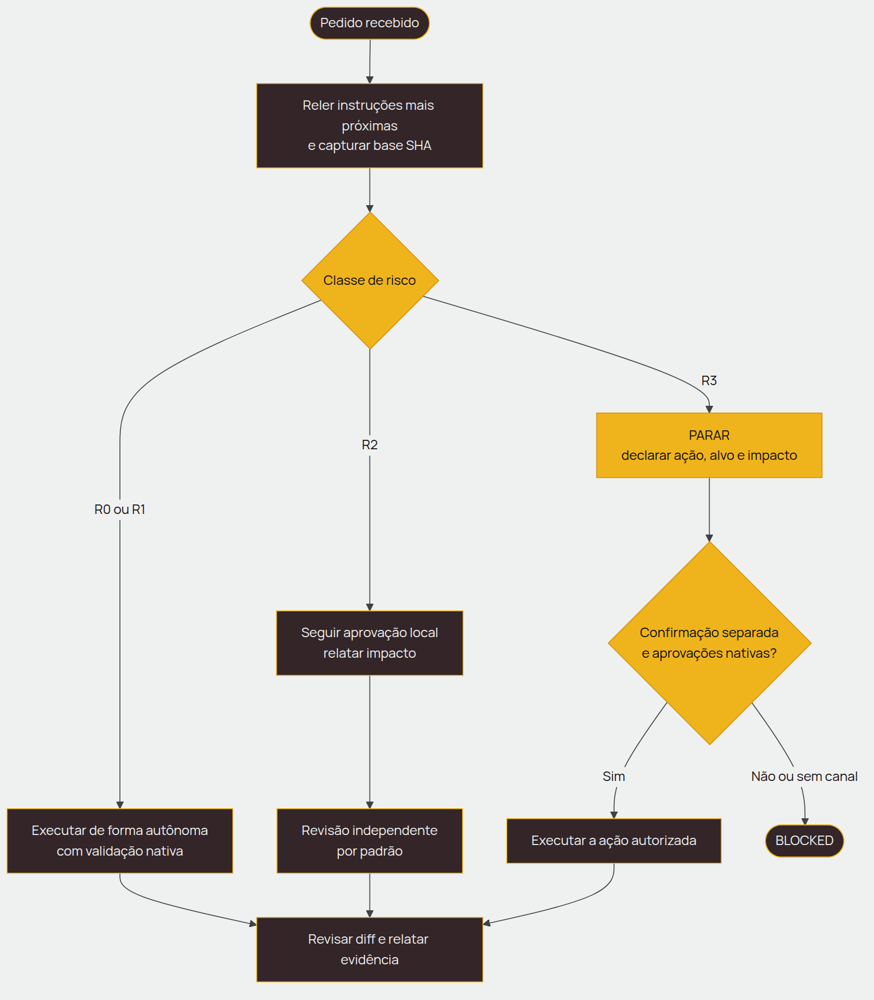
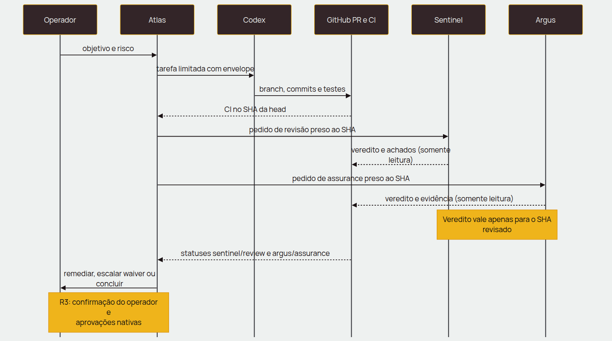
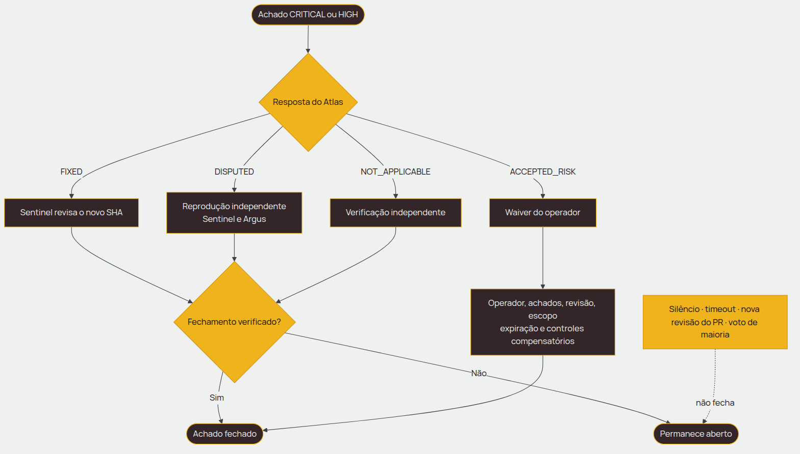
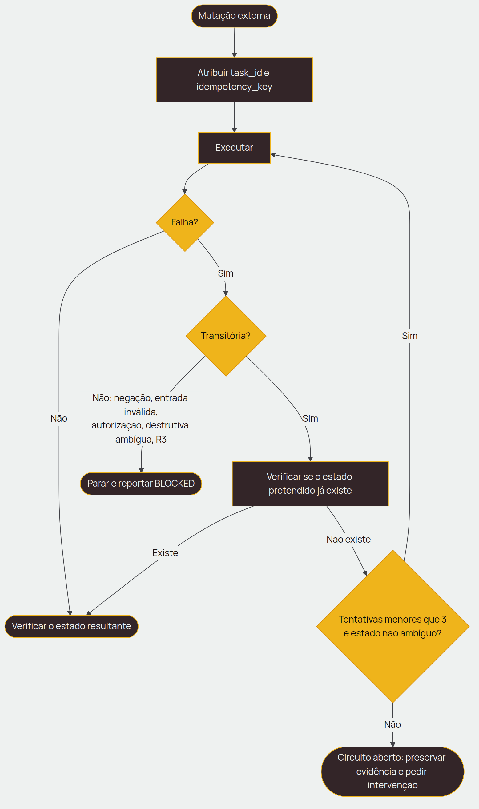
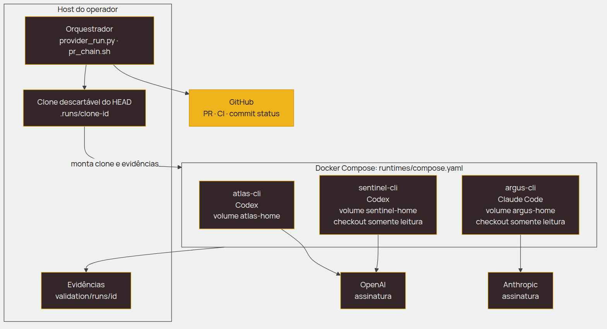

# Visão geral da solução

Navegação: [Índice](00-toc.md) · anterior: [01 Contexto](01-contexto.md) · próximo: [03 Requisitos funcionais](03-requisitos-funcionais.md)

## Natureza da solução

✅ **Confirmado na implementação atual:** o projeto combina governança declarativa (Markdown/YAML/JSON) com o CLI Linux `ai-team`, scripts de validação e harness. Não há servidor, banco de dados ou interface web próprios. A interface de operação é a linha de comando; [instalação e fluxo atual](LOCAL-LINUX-WORKFLOW.md).

AGENTS, skills, templates e specs definem políticas; sua presença não prova cumprimento pelo agente. O código do coordenador e as permissões nativas determinam os controles executáveis. Alterações normativas exigem avaliação de impacto e validação compatível; as recomendações REC-004, REC-006, REC-009, REC-010 e REC-011 pertencem à análise da baseline.

## Arquitetura

Fonte editável: [01-arquitetura-planos.mmd](anexos/diagramas/01-arquitetura-planos.mmd).

O design de endurecimento define quatro planos, em que um plano inferior pode ser mais estrito, nunca mais fraco que um superior:

1. **Plano nativo do Dot:** identidade, memória, plugins, visão de atividade, Custom Rules e revisão nativa de ações.
2. **Plano de governança:** este repositório (OpenSpec, AGENTS.md, skills, registro, roteamento, risco, evidência).
3. **Plano de execução:** Codex para código; Work para pesquisa e artefatos; plugins para sistemas externos.
4. **Plano do repositório alvo:** instruções locais, proteções de branch, CI, testes e controles de deploy.

As camadas lógicas do design de bootstrap complementam esse quadro: L0 governança, L1 orquestração, L2 skills especialistas, L3 adaptadores de projeto, L4 adaptadores de ferramentas e L5 evidência.

## Componentes

| Componente | Caminho | Função |
| --- | --- | --- |
| Contrato dos agentes | `AGENTS.md` | Missão, precedência, ciclo de vida, risco, roteamento, confiabilidade, concorrência, regras de engenharia, definição de pronto, recuperação e relatório |
| Skills (13) | `skills/` | Pacotes catalogados por categoria, versão, maturidade, dependências, risco, contratos e gates em [`catalog.yaml`](../skills/catalog.yaml); procedimentos em `SKILL.md` |
| Políticas e arquitetura | `docs/*.md`, `docs/adr/`, `docs/workflows/` | Frescor, isolamento, confiabilidade, concorrência, entrega, recuperação, roteamento, plugins, dupla revisão, garantia entre fornecedores, ambientes de execução e fluxos de trabalho |
| Templates e contratos | `templates/` | Envelope de tarefa, lease, evidência, manifest de política, registro de projetos, pedido e resultado de revisão, waiver, bootstrap do Atlas e do Sentinel, relatório de conclusão |
| Runbooks | `runbooks/` | Configuração do Atlas e do Sentinel, garantia pelo Claude e runtimes em contêiner |
| OpenSpec | `openspec/` | Visão do projeto, roadmap, specs de capacidade e mudanças versionadas com proposta, design e tarefas |
| Validação | `validation/`, `tests/scenarios.md` | Cenários, fixtures, manifests e relatórios de execução, waivers |
| Scripts e CLI | `scripts/`, `bin/ai-team` | Instalador, coordenador local, preflight, contratos, validadores e harness/transporte histórico |
| Runtimes | `runtimes/` | `Dockerfile` e `compose.yaml` dos três contêineres |
| CI | `.github/workflows/validate.yml` | Executa validadores, testes, documentação e canaries Docker/instalação em push e PR |

## Tecnologias e dependências

| Item | Detalhe | Evidência |
| --- | --- | --- |
| Linguagens | Markdown e YAML (artefatos); Python 3 (validadores e harness); Bash (`pr_chain.sh`); Dockerfile e Compose | `scripts/`, `runtimes/` |
| Bibliotecas Python | PyYAML 6.0.3 e jsonschema 4.26.0, fixadas | `requirements-validation.txt` |
| CI | GitHub Actions, `ubuntu-latest`, checkout/setup-python v7 fixados por SHA, Python 3.12 | `.github/workflows/validate.yml` |
| Imagem dos contêineres | `node:22-bookworm-slim` com Git, Python/venv, dependências de validação, ripgrep e ca-certificates | `runtimes/Dockerfile` |
| CLIs de provedor | `@openai/codex` 0.159.3 e `@anthropic-ai/claude-code` 2.1.287, versões fixadas por argumento de build | `runtimes/Dockerfile` |
| Isolamento do contêiner | Local: UID 1001, rootfs somente leitura, tmpfs, capabilities removidas, limites e Git metadata read-only; Compose histórico admite UID do host | `scripts/local_team.py`, `runtimes/compose.yaml` |
| Orquestração local | Linux, Python 3.10+ com venv/ensurepip, Git e Docker Engine; gh para PR; Compose apenas no harness histórico | `scripts/install-local.sh`, `scripts/local_team.py`, `scripts/pr_chain.sh` |

⚠️ **Limite atual:** dependências diretas de validação e versões dos CLIs são fixadas, mas a imagem base continua por tag e dependências transitivas podem variar. Cada tarefa local congela os IDs das imagens disponíveis no início; isso não torna todo build reproduzível.

## Fluxo local implementado

`ai-team init` configura checks e imagem offline fora do alvo. `run` cria clone independente, solicita plano/implementação Atlas, faz commit no host, checks offline e revisões Sentinel/Argus no mesmo SHA; correções respeitam ciclos e prazo. `deliver` importa branch e pode publicar/abrir PR draft, sem trocar o checkout do alvo. GitHub CI, autorização de merge e deploy são posteriores. Consulte [entrega](DELIVERY-LIFECYCLE.md) e [recuperação](SESSION-STATE.md).

Os diagramas abaixo descrevem a arquitetura normativa e o harness da baseline de 2026-10-01; não representam todos os detalhes do CLI local.

## Ciclo de vida do trabalho

Fonte editável: [03-ciclo-de-vida.mmd](anexos/diagramas/03-ciclo-de-vida.mmd).

O ciclo de vida aparece em três versões nos documentos de origem:

| Versão | Etapas | Fonte |
| --- | --- | --- |
| AGENTS.md | INTAKE, FRESHNESS, DISCOVER, CLASSIFY, LEASE, PLAN, EXECUTE, VERIFY, REVIEW, REPORT (10) | `AGENTS.md` |
| Design do bootstrap | INTAKE, DISCOVER, PLAN, EXECUTE, VERIFY, REVIEW, REPORT (7), com aprovação antes de ações de alto risco | `openspec/changes/bootstrap-agentic-engineering-team/design.md` |
| Design de endurecimento | INTAKE, FRESHNESS, CLASSIFY, LEASE, PLAN, EXECUTE, VERIFY, REVIEW, PR, CI, APPROVAL, MERGE, RELEASE, OBSERVE, CLOSE (15) | `openspec/changes/harden-engineering-dot/design.md` |

🔄 **Regra de leitura adotada nesta documentação:** o ciclo do `AGENTS.md` é o normativo para a condução do trabalho (a precedência põe o AGENTS.md acima do OpenSpec e das skills); a variante de 7 etapas é anterior e subconjunto dele; as etapas de PR a CLOSE do design de endurecimento estendem o ciclo para a entrega e não substituem as etapas anteriores. Isso é uma **interpretação** que dá coerência às fontes. As fontes não declaram essa hierarquia; a harmonização nos documentos de origem está pendente (REC-004).

## Fluxos principais

### Decisão por classe de risco

Fonte editável: [02-decisao-risco.mmd](anexos/diagramas/02-decisao-risco.mmd). Regras: RN-004, RN-005, RN-006, RN-007 em [05-regras-de-negocio.md](05-regras-de-negocio.md).

### Cadeia de revisão independente

Fonte editável: [04-cadeia-revisao.mmd](anexos/diagramas/04-cadeia-revisao.mmd). Regras: RN-036 a RN-041. O transporte é o repositório: pedido e veredito ficam presos a um SHA imutável; nenhuma sessão compartilhada entre modelos é necessária.

### Tratamento de achados

Fonte editável: [05-decisao-achado.mmd](anexos/diagramas/05-decisao-achado.mmd). Regras: RN-038 e RN-039.

### Mutação externa, retentativa e circuit breaker

Fonte editável: [07-retentativa-circuito.mmd](anexos/diagramas/07-retentativa-circuito.mmd). Regras: RN-024 a RN-026.

### Execução por CLI em contêineres

Fonte editável: [06-runtimes-conteineres.mmd](anexos/diagramas/06-runtimes-conteineres.mmd). Regras: RN-042, RN-043 e RN-052. No harness histórico, o transporte usa Git/gh do operador e filtra variáveis de GitHub/SSH-agent dos filhos. Isso não cobre credenciais embutidas em arquivos/imagens. No CLI local, checks offline não recebem volumes de contas nem socket Docker; agentes podem ler suas próprias credenciais.

## Protótipos e mockups

Não há interface gráfica/web própria ou capturas de tela do CLI local. As visualizações disponíveis são os sete diagramas desta documentação, listados acima, com fonte editável em `docs/anexos/diagramas/`.

⚠️ **Atenção:** as imagens do diretório de identidade visual (cartões, publicações, telas de exemplo) são aplicações de **marca** e não representam este sistema; foram usadas somente como referência de identidade (ver [anexos/identidade/README.md](anexos/identidade/README.md)).

## Dependências e integrações

| Integração | Natureza | Uso | Contrato | Evidência |
| --- | --- | --- | --- | --- |
| GitHub (repositório, PR, CI) | Sistema terceiro | Hospeda o repositório, executa o CI e recebe os statuses por SHA | Parcial: [github-commit-status.yaml](anexos/swagger/github-commit-status.yaml) cobre o status de commit | `scripts/pr_chain.sh`, `.github/workflows/validate.yml` |
| CLI `gh` | Ferramenta | Local: abre PR draft na entrega; harness: cria/fecha fixtures, comenta e publica statuses | Flags documentadas no guia local; transporte histórico separado | `scripts/local_team.py`, `scripts/pr_chain.sh` |
| Codex CLI (OpenAI) | Serviço de provedor | Atlas e Sentinel no plano de execução, por assinatura | Fornecido pelo provedor | `runtimes/Dockerfile`, `scripts/provider_run.py` |
| Claude Code CLI (Anthropic) | Serviço de provedor | Argus, por assinatura | Fornecido pelo provedor | `runtimes/Dockerfile`, `scripts/provider_run.py` |
| Docker e Compose | Infraestrutura local | Contêineres por conta com volumes de credenciais | `runtimes/compose.yaml` | `runbooks/CONTAINER-RUNTIMES.md` |
| Engineering Dot (Atlas e Sentinel ao vivo) | Plataforma nativa | Coordenação persistente e revisão independente | Não exercitada | `docs/DOT-NATIVE-ARCHITECTURE.md` |
| Plugins e apps conectados | Sistemas externos | Leitura e ação estreita sob permissões nativas | Matriz em `templates/PLUGIN-ACCESS-MATRIX.yaml` | `docs/DOT-PLUGIN-POLICY.md` |
| ChatGPT Work | Superfície nativa | Pesquisa e artefatos | Não exercitada | `docs/ROUTING-MATRIX.md` |

Não há banco de dados, fila, microsserviço ou serviço de autenticação próprios. A autenticação é de responsabilidade de cada CLI (login interativo por assinatura), com credenciais mantidas só nos volumes Docker por conta.

REC-011 registrou divergência de comandos na baseline. O registro de exemplo aponta agora para [VALIDATION.md](VALIDATION.md), que lista as verificações atuais. Não usar a configuração YAML de portfólio como substituta de `ai-team init`.
